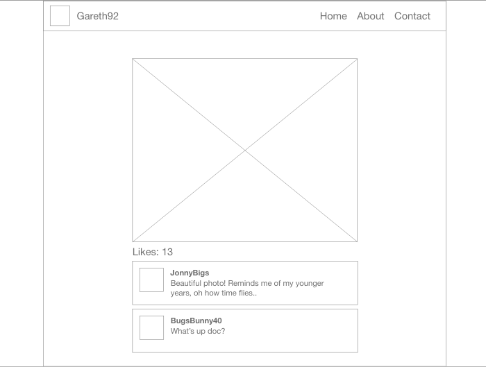

Instagram Challenge
===================

## Instructions

* Challenge time: one weekend
* Feel free to use Google, your notes, books, etc., but work on your own
* If you refer to the solution of another coach or student, please put a link to that in your README
* If you have a partial solution, **still check in a partial solution**
* You must submit a pull request to this repo with your code by 9am Monday morning

## Task

Build Instagram: Simple huh!

Your challenge is to build Instagram using Rails. You'll need **users** who can post **pictures**, write **comments** on pictures and **like** a picture. Style it like Instagram's website (or more awesome).

Bonus if you can add filters!

## How to start

1. Produce some stories, break them down into tasks, and estimate
2. Fork this repo, clone, etc
3. Initialize a new rails project

Remember to proceed in small steps! Getting confused? Make the steps even smaller.

## Code Quality

For linting, you can use the `.rubocop.yml` in this repository (or your own!).
You'll need these gems:

```ruby
gem "rubocop", "0.79.0", require: false
gem "rubocop-rails"
```

You can also lint Javascript, CSS, and ERB — feel free to research this. These
will help you to train yourself to produce cleaner code — and will often alert
you to mistakes or mishaps!

_______________________

# Development Log

## Reflection
### 7th June 2020
Oh my goodness, these challenges get harder every week! 

Somehow I have managed to get some basic funtionality working in my instagram clone app!

So far:
Users can register and login to their home page
Users can add and remove pictures
Users can comment on pictures
Users can visit other user page's (albiet manually through the URL)

Things to do:
Create a 'Like' model so users can like pictures
Overall 'look and feel' of the views need some work
Disable features if on another users page (i.e you can't delete someone else's picture!)

## User Stories
```
As a User
So I can show everyone I lead a full and interesting life
I want to be able to post pictures
```
```
As a User
So I can show my support
I want to be able to like other users pictures
```
```
As a User
So I can express my thoughts
I want to to be able to write comments on pictures
```

## Relationships
### User
```
- User has many Pictures
- User has many Comments
- User has many Likes
```

### Picture
```
- Picture belongs to one User
- Picture has many Comments
- Picture has many Likes
```

### Comment
```
- Comment belongs to one User
- Comment belongs to one Picture
```

### Like
```
- Like belongs to one User
- Like belongs to one Picture
```

## ERD


## User Page - Mockup

